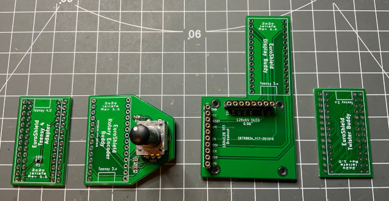

# es_buddy - EuroShield Add On Boards

 

EuroShield Buddy PCB Boards and Arduino Library.

  - [Teensy 4.0 Adapter](#teensy-40-adapter)
  - [Rotary Encoder Buddy Board](#rotary-encoder-buddy-board)
  - [LCD/OLED Display Buddy Board](#lcd/oled-display-buddy-board)
  - [Twister Buddy Board](#twister-buddy-board)

You can combine these boards as you like.

Licensed by Creative Commons Attribution Share Alike 4.0 International

## Teensy 4.0 Adapter

Version: 1.1

This little adapter board allows to use a Teensy 4.0 board on your EuroShield 1 (short ES) eurorack module.

This is the required re-routing of the Pins:

| Teensy 3.x / EuroShield Pin | Teensy 4.x Pin | Description |
|-----------------------------|----------------|-------------|
| GND | GND | |
| 0 | 0 | Midi IN |
| 1 | 1 | Midi Out |
| 2 | 2 | Button on ES and on Rotary Encoder |
| 3 | 3 | LED 1 |
| 4 | 4 | LED 2 |
| 5 | 5 | LED 2 |
| 6 | 6 | LED 3 |
| 7 | 11 | SPI MOSI |
| 8 | 9 | Display Reset |
| 9 | 21 | Audio BCLK |
| 10 | 10 | SPI CS |
| 11 | 23 | Audio MCLK - A 100 Ohm Resistor is required here! |
| 12 | 12 | SPI MISO |

| Teensy 3.x / EuroShield Pin | Teensy 4.x Pin | Description |
|-----------------------------|----------------|-------------|
| VIN | VIN | |
| AGND | AGND | |
| 3.3V | 3.3V | |
| 23 | 20 | Audio LRCLK |
| 22 | 7 | Audio TX DIN |
| 21 | 15 | Lo Pot on ES |
| 20 | 14 | Hi Pot on ES |
| 19 | 19 | I2C SCL |
| 18 | 18 | I2C SDA |
| 17 | 17 | Rotary Encoder A |
| 16 | 16 | Rotary Encoder B |
| 15 | 22 | Display CMD/Data |
| 14 | 13 | SPI SCK |
| 13 | 8 | Audio RX DOUT |

All Pins are direclty connected expect Audio MCLK is connected via
a 100 Ohm resistor.

## Rotary Encoder Buddy Board

Version: 1.1

Add a rotary encoder with button to your Euroshield.

### BOM

| Symbol | Part | Description | Mouser No. |
|--------|------|-------------|------------|
| ROT1 | PEC12R-3220F-S0024 | Bourns Rotary Encoder | 652-PEC12R3220FS0024 |
| R1-R3 | SMD 0805 10k | 10k Resistor | 71-CRCW080510K0FKEAC |

## LCD/OLED Display Buddy Board

Version: 1.1

Add an SPI LCD or OLED display to your EuroShield. While the OLED with 
128 x 64 fits nicely into the form factor of the shield, the LCD is wider
and offers 160 x 128 colored pixels.

The LCD has the following parameters:

 - 160 x 128 color TFT LCD 1.8 Inch
 - SPI
 - ST 7735 Controller

| LCD Pin | Teensy 3.2 Pin | Description |
| ------- | ---------- | ----------- |
| 1 | GND | GND |
| 2 | 3.3V | 3.3V |
| 3 | 8  | Display Reset |
| 4 | 15 | Display Cmd/Data |
| 5 | -  | N/A |
| 6 | 10 | SPI CS |
| 7 | 7  | SPI MOSI |
| 8 | 14 | SPI SCK |
| 9 | 12 | SPI MISO |
| 10 | 3.3V | Display Light |

I use an Adafruit 1.8" Color TFT LCD display with MicroSD Card Breakout (358)

The OLED has the following parameters:

- 128 x 64 monochrome OLED 0.96 Inch
- SPI
- SSD 1306 Controller

| OLED Pin | Teensy 3.2 Pin | Description |
| ------- | ---------- | ----------- |
| 1 | 3.3V | 3.3V |
| 2 | GND | GND |
| 3 | -  | N/A|
| 4 | 7  | SPI MOSI |
| 5 | 14 | SPI SCK |
| 6 | 10 | SPI CS |
| 7 | 15 | Display Cmd/Data |
| 8 | 8  | Display Reset |

## Twister Buddy Board

Version: 1.0

Turn the Teensy around so that the USB connector points upwards and 
a connected USB cable gets out of the way and does not obstruct the display.

# Build Instructions

If you want to build the full stack of buddy boards:

1. Start with the display board and solder extra long header pins

  

2. First populate the rotary encoder board (resistors and the encoder) and 
  then solder the board below the display board

  

3. Prepare the Twister Board by adding headers to one side for a Teensy 4.0
  setup or a female connector for a Teensy 3.2. If you want to 
  use a Teensy 4.0 then add a female connector to the Teensy 4.0 side of the
  adapter:

  

4. Solder the prepared Twister Board on top of the Display Board. Make sure
  that the Teensy USB port on the top side points upwards:

  

5. For a Teensy 4.0 finally solder the Teensy 4.0 adapter board on top of
  the Twister Board. Note: make sure to add some space between the boards
  so that the Teensy 4.0 female connector pins do not touch the Display
  Board pins! Here a both variants: Teensy 4.0 and Teensy 3.2 boards

  

6. Finally add either a LCD or OLED display. Both display types work with 
  both Teensy CPUs.

  

